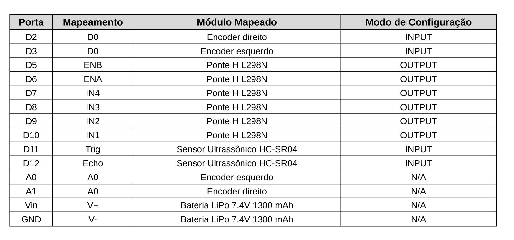

# Trabalho de Conclusão de Curso de Engenharia de Computação - Desenvolvimento Didático de um Robô Móvel Diferencial para o Ensino de Robótica

# Universidade Tecnológica Federal do Paraná, Campus de Pato Branco

## Aluno: Mário Alexandre Rodrigues

## Orientadores: Profa. Dra. Kathya Linares, Prof. Dr. Jefferson Lima

O presente trabalho tem como objetivo realizar e documentar o desenvolvimento de um robô móvel diferencial de forma que este seja utilizado por alunos iniciantes do curso de engenharia de computação como uma base para suas próprias implementações. O desenvolvimento do presente robô móvel conta com um algoritimo simples de desvio de obstáculos, bem como um conjunto de funções intermediárias que auxiliem no controle e obtenção dos dados dos sensores do robô.

O robô móvel, também conhecido como robô móvel com tração diferencial, possui rodas sobre um mesmo eixo (virtual) que podem acionadas de forma independente. Esse é um modelo versátil e que pode ser integrado com diversos sensores, possibilitando utilizá-lo em inúmeras aplicações.

Este repositório busca servir como uma documentação do trabalho desenvolvido para auxiliar os estudantes na construção de seus próprios robôs diferenciais e/ou funções e algoritmos que utilizem sensores e atuadores similares.

## Materiais Utilizados

Segue abaixo a lista dos materiais utilizados na construção do robô móvel:

* x1 Arduino UNO R3
* x1 Módulo Ponte H L298N
* x1 Sensor Ultrassom HC-SR04
* x1 Chassi Robô Móvel - 2WD
* x2 Encoder óptico – Chave Óptica
* x2 Disco Encoder 20 Dentes
* x2 Motor CC com caixa de redução
* x1 Roda omni-direcional
* x2 Roda Hobby com pneu
* x1 Bateria LiPo 1300 mAh 7.4V
* x2 Protoboard 170 pontos
* x1 Chave interruptora

Além dos materiais citados acima, o desenvolvimento do código foi realizado utilizando o programa .

## Desenvolvimento

O primeiro passo para a construção do robô é entender como funcionam as peças, porque elas são necessárias e como são integradas ao projeto final. Portanto, seguem os detalhes das principais peças no contexto do robô móvel criado:

### 1 - Motor CC

Os motores de corrente contínua (CC) são sensores que transformam energia elétrica em energia mecânica. Também conhecidos como atuadores, os motores DC são os componentes que possibilitam o movimento do robô móvel. Eles podem ser acionados tanto em um sentido quanto em outro, possibilitando o movimento do robô tanto para frente quanto para trás.


### 2 - Ponte H

A ponte H é um dos circuitos mais importantes no tocante a elaboração de sistemas automatizados. Trata-se de um circuito utilizado para o acionamento de motores CC através de sinais digitais gerados por um microcontrolador.

Um motor CC, quando conectado diretamente a uma bateria, gira em uma velocidade constante em uma única direção. Para que este mesmo motor gire no sentido inverso, é necessário inverter seus polos.
Uma ponte H básica é composta por 4 chaves mecânicas ou eletrônicas posicionadas formando a letra “H”, sendo cada chave alocada em um extremo e o motor centralizado.


Logo, para que o motor seja acionado, basta acionar um par de chaves diagonalmente opostas, de forma que a corrente flua de forma direta, ou seja, do polo positivo para o polo negativo do motor. Já para provocar um fluxo reverso da corrente, é necessário acionar apenas o outro par de chaves.

O módulo Ponte H L298N é um módulo de controle de motor DC de dois canais. É composto por três pinos de alimentação; seis pinos de controle; e quatro pinos de saída. Esse módulo conta com duas entradas digitais para cada um dos motores DC (IN1, IN2 ou IN3, IN4) que possibilitam o controle do sentido de rotação desses motores através de sinais lógicos enviados pelo Arduino, assim como um pino de entrada adicional (ENA ou ENB) que permite controlar a velocidade de rotação dos mesmos, variando entre a tensão de entrada aplicada nas portas VCC e GND.


Onde:
    *IN1: Primeira entrada digital do primeiro motor
    *IN2: Segunda entrada digital do primeiro motor
    *IN3: Primeira entrada digital do primeiro motor
    *IN4: Segunda entrada digital do primeiro motor
    *ENA: Regulador da tensão de saída do primeiro motor
    *ENB: Regulador da tensão de saída do primeiro motor
    *OUT1: Primeira saída digital do primeiro motor
    *OUT2: Segunda saída digital do primeiro motor
    *OUT3: Primeira saída digital do segundo motor
    *OUT4: Segunda saída digital do segundo motor
    *VCC: Alimentação do módulo
    *GND: Alimentação do módulo

### 3 - Sensor de Ultrassom

sensores baseados em ultrassom (sonar) são componentes comumente utilizados para medir a distância de objetos. Ao emitir um pulso sonoro, é possível calcular o tempo que leva para que ele seja refletido e retorne ao sensor. Como a velocidade do pulso emitido no meio é conhecida, é possível então calcular a distância entre o sensor e o objeto cujo pulso foi refletido.

Neste projeto, o sensor de ultrassom, utilizado prioritariamente para medir a proximidade do robô móvel com os obstáculos os quais ele deve evitar, é o sensor HC-SR04. Esse modelo é o modelo mais comum desse tipo de sensor e possui quatro pinos: dois para alimentação: VCC e GND; e dois pinos de saída digital (TRIG e ECHO) que informam ao arduino o momento em que a onda sonora é emitida e recebida, respectivamente.


### 4 - *Encoders* Ópticos

os *encoders* ópticos, também conhecidos como sensores de deslocamento ou sensores odométricos, são sensores capazes de quantizar distâncias, controlar velocidades, medir ângulos, número de rotações, realizar posicionamentos, rotacionar braços robóticos, dentre outras funcionalidades. O *encoder* óptico é composto basicamente por um componente emissor (LED), um receptor (fotodetector) e um disco opaco com aberturas igualmente espaçadas. Este disco, quando fixo ao eixo da roda do veículo, gera um sinal de saída na forma de onda quadrada, ao bloquear e desbloquear o feixe de luz emitido pelo LED para o fotodetector. Logo, é chamado de resolução do *encoder*, ou *clock*, a quantidade de ondas quadradas geradas em uma volta completa, que equivale a quantidade de aberturas no disco.

No modelo apresentado posteriormente, os *encoders* estão acoplados aos motores por se tratarem de peças dependentes. Já no protótipo do robô móvel, também apresentado posteriormente, estes sensores ópticos foram dispostos de forma que seja possível ler o disco perfurado o qual está acoplado às respectivas caixas de redução dos motores DC. Estes sensores possuem quatro pinos cada: dois de alimentação: VCC, GND; uma saída digital: D0; e uma saída analógica: A0.


### 5 - Microcontrolador

Um microcontrolador é um único circuito integrado composto por um núcleo de processador, memórias voláteis e não voláteis e diversos periféricos para transferência de dados. Ou seja, ele nada mais é que um computador compacto capaz de realizar diversas tarefas de forma eficaz.

Mantendo a analogia ao corpo humano, um microcontrolador pode ser considerado o cérebro do robô. É nele onde todos os cálculos serão feitos e as ações serão decididas. O módulo do microcontrolador é composto majoritariamente pelo algoritmo que o robô móvel executa para realizar o conjunto de tarefas que lhe é imposto.

A seguir o modelo esquemático é apresentado como um guia para a construção do robô móvel. Este modelo está disposto da mesma forma que o protótipo desenvolvido, contornado por uma moldura de mesmo formato do chassi utilizado para que seja fácil a assimilação da disposição das peças. Logo após, é descrito o mapeamento das portas utilizadas do Arduino para os respectivos módulos de entrada/saída, assim como a natureza das conexões.




### Implementações de Código

Nesta seção serão descritas as funções criadas para o funcionamento do robô móvel, assim como o algoritmo exemplo para desvio de obstáculos. Os respectivos códigos podem ser encontrados no arquivo robo_movel/robo_movel.cpp.

#### Função *move()*

A função *move* foi desenvolvida para para facilitar a configuração das portas de entrada do módulo ponte H para acionar os dois motores na mesma direção e com a mesma velocidade, fazendo assim que o robô móvel se movimente linearmente para frente ou para trás.

##### Parâmetros de Entrada

* *direction*(char*): Determina em qual direção o robô irá se movimentar: "forward", para frente; "backward", para trás.

##### Retorno

Essa função não possui retorno.

##### Exemplo de Utilização

```cpp
void loop() {
    // Move o robô para frente por 1 segundo
    move("forward");
    delay(1000);
    // Move o robô para trás por 1 segundo
    move("backward");
    delay(1000);
}
```

#### Função *stop()*

Oposta à função *move*, a função *stop* realiza a parada dos dois motores DC.

##### Parâmetros de Entrada

Essa função não possui parâmetros de entrada.

##### Retorno

Essa função não possui retorno.

##### Exemplo de Utilização

```cpp
void loop() {
    // Move o robô para frente por 1 segundo
    move("forward");
    delay(1000);
    // Paralisa o robô por 1 segundo
    stop();
    delay(1000);
    // Move o robô para trás por 1 segundo
    move("backward");
    delay(1000);
}
```
