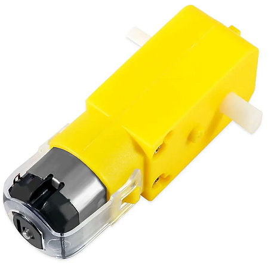

# Trabalho de Conclusão de Curso de Engenharia de Computação - Desenvolvimento Didático de um Robô Móvel Diferencial para o Ensino de Robótica

## Universidade Tecnológica Federal do Paraná, Campus de Pato Branco

### Aluno: Mário Alexandre Rodrigues

### Orientadores: Profa. Dra. Kathya Linares, Prof. Dr. Jefferson Lima

---

O presente trabalho tem como objetivo realizar e documentar o desenvolvimento de um robô móvel diferencial de forma que este seja utilizado por alunos iniciantes do curso de engenharia de computação como uma base para suas próprias implementações. O desenvolvimento do presente robô móvel conta com um algoritimo simples de desvio de obstáculos, bem como um conjunto de funções intermediárias que auxiliem no controle e obtenção dos dados dos sensores do robô.

O robô móvel, também conhecido como robô móvel com tração diferencial, possui rodas sobre um mesmo eixo (virtual) que podem acionadas de forma independente. Esse é um modelo versátil e que pode ser integrado com diversos sensores, possibilitando utilizá-lo em inúmeras aplicações.

Este repositório busca servir como uma documentação do trabalho desenvolvido para auxiliar os estudantes na construção de seus próprios robôs diferenciais e/ou funções e algoritmos que utilizem sensores e atuadores similares.

## Materiais Utilizados

Segue abaixo a lista dos materiais utilizados na construção do robô móvel:

* x1 Arduino UNO R3
* x1 Módulo Ponte H L298N
* x1 Sensor Ultrassom HC-SR04
* x1 Chassi Robô Móvel - 2WD
* x2 Encoder óptico – Chave Óptica
* x2 Disco Encoder 20 Dentes
* x2 Motor CC com caixa de redução
* x1 Roda omni-direcional
* x2 Roda Hobby com pneu
* x1 Bateria LiPo 1300 mAh 7.4V
* x2 Protoboard 170 pontos
* x1 Chave interruptora

Além dos materiais citados acima, o desenvolvimento do código foi realizado utilizando o programa [Arduino IDE v2.3.2](https://www.arduino.cc/en/software).

## Desenvolvimento

As figuras a seguir apresentam o diagrama básico de um robô móvel, com exemplos de componentes utilizados em cada módulo e o protótipo desenvolvido para esse projeto. Essa modulação irá nortear tanto o seccionamento deste capítulo, quanto o desenvolvimento de todo o projeto.


O primeiro passo para a construção do robô é entender como funcionam as peças, porque elas são necessárias e como são integradas ao projeto final. Portanto, seguem os detalhes das principais peças no contexto do robô móvel criado:

### 1 - Motor CC

Os motores de corrente contínua (CC) são sensores que transformam energia elétrica em energia mecânica. Também conhecidos como atuadores, os motores DC são os componentes que possibilitam o movimento do robô móvel. Eles podem ser acionados tanto em um sentido quanto em outro, possibilitando o movimento do robô tanto para frente quanto para trás.



### 2 - Ponte H

A ponte H é um dos circuitos mais importantes no tocante a elaboração de sistemas automatizados. Trata-se de um circuito utilizado para o acionamento de motores CC através de sinais digitais gerados por um microcontrolador.

Um motor CC, quando conectado diretamente a uma bateria, gira em uma velocidade constante em uma única direção. Para que este mesmo motor gire no sentido inverso, é necessário inverter seus polos.
Uma ponte H básica é composta por 4 chaves mecânicas ou eletrônicas posicionadas formando a letra “H”, sendo cada chave alocada em um extremo e o motor centralizado.


Logo, para que o motor seja acionado, basta acionar um par de chaves diagonalmente opostas, de forma que a corrente flua de forma direta, ou seja, do polo positivo para o polo negativo do motor. Já para provocar um fluxo reverso da corrente, é necessário acionar apenas o outro par de chaves.

O módulo Ponte H L298N é um módulo de controle de motor DC de dois canais. É composto por três pinos de alimentação; seis pinos de controle; e quatro pinos de saída. Esse módulo conta com duas entradas digitais para cada um dos motores DC (IN1, IN2 ou IN3, IN4) que possibilitam o controle do sentido de rotação desses motores através de sinais lógicos enviados pelo Arduino, assim como um pino de entrada adicional (ENA ou ENB) que permite controlar a velocidade de rotação dos mesmos, variando entre a tensão de entrada aplicada nas portas VCC e GND.


Onde:

* **IN1**: Primeira entrada digital do primeiro motor

* **IN2**: Segunda entrada digital do primeiro motor

* **IN3**: Primeira entrada digital do primeiro motor

* **IN4**: Segunda entrada digital do primeiro motor

* **ENA**: Regulador da tensão de saída do primeiro motor

* **ENB**: Regulador da tensão de saída do primeiro motor

* **OUT1**: Primeira saída digital do primeiro motor

* **OUT2**: Segunda saída digital do primeiro motor

* **OUT3**: Primeira saída digital do segundo motor

* **OUT4**: Segunda saída digital do segundo motor

* **VCC**: Alimentação do módulo

* **GND**: Alimentação do módulo

### 3 - Sensor de Ultrassom

sensores baseados em ultrassom (sonar) são componentes comumente utilizados para medir a distância de objetos. Ao emitir um pulso sonoro, é possível calcular o tempo que leva para que ele seja refletido e retorne ao sensor. Como a velocidade do pulso emitido no meio é conhecida, é possível então calcular a distância entre o sensor e o objeto cujo pulso foi refletido.

Neste projeto, o sensor de ultrassom, utilizado prioritariamente para medir a proximidade do robô móvel com os obstáculos os quais ele deve evitar, é o sensor HC-SR04. Esse modelo é o modelo mais comum desse tipo de sensor e possui quatro pinos: dois para alimentação: VCC e GND; e dois pinos de saída digital (TRIG e ECHO) que informam ao arduino o momento em que a onda sonora é emitida e recebida, respectivamente.


### 4 - *Encoders* Ópticos

os *encoders* ópticos, também conhecidos como sensores de deslocamento ou sensores odométricos, são sensores capazes de quantizar distâncias, controlar velocidades, medir ângulos, número de rotações, realizar posicionamentos, rotacionar braços robóticos, dentre outras funcionalidades. O *encoder* óptico é composto basicamente por um componente emissor (LED), um receptor (fotodetector) e um disco opaco com aberturas igualmente espaçadas. Este disco, quando fixo ao eixo da roda do veículo, gera um sinal de saída na forma de onda quadrada, ao bloquear e desbloquear o feixe de luz emitido pelo LED para o fotodetector. Logo, é chamado de resolução do *encoder*, ou *clock*, a quantidade de ondas quadradas geradas em uma volta completa, que equivale a quantidade de aberturas no disco.

No modelo apresentado posteriormente, os *encoders* estão acoplados aos motores por se tratarem de peças dependentes. Já no protótipo do robô móvel, também apresentado posteriormente, estes sensores ópticos foram dispostos de forma que seja possível ler o disco perfurado o qual está acoplado às respectivas caixas de redução dos motores DC. Estes sensores possuem quatro pinos cada: dois de alimentação: VCC, GND; uma saída digital: D0; e uma saída analógica: A0.


### 5 - Microcontrolador

Um microcontrolador é um único circuito integrado composto por um núcleo de processador, memórias voláteis e não voláteis e diversos periféricos para transferência de dados. Ou seja, ele nada mais é que um computador compacto capaz de realizar diversas tarefas de forma eficaz.

Mantendo a analogia ao corpo humano, um microcontrolador pode ser considerado o cérebro do robô. É nele onde todos os cálculos serão feitos e as ações serão decididas. O módulo do microcontrolador é composto majoritariamente pelo algoritmo que o robô móvel executa para realizar o conjunto de tarefas que lhe é imposto.

A seguir o modelo esquemático é apresentado como um guia para a construção do robô móvel. Este modelo está disposto da mesma forma que o protótipo desenvolvido, contornado por uma moldura de mesmo formato do chassi utilizado para que seja fácil a assimilação da disposição das peças. Logo após, é descrito o mapeamento das portas utilizadas do Arduino para os respectivos módulos de entrada/saída, assim como a natureza das conexões.


Porta | Mapeamento | Módulo Mapeado | Modo de Configuração
:------: | :------: | :------: | :------:
D2 | D0 | Encoder direito | INPUT
D3 | D0 | Encoder esquerdo | INPUT
D5 | ENB | Ponte H L298N | OUTPUT 
D6 | ENA | Ponte H L298N | OUTPUT
D7 | IN4 | Ponte H L298N | OUTPUT
D8 | IN3 | Ponte H L298N | OUTPUT
D9 | IN2 | Ponte H L298N | OUTPUT
D10 | IN1 | Ponte H L298N | OUTPUT
D11 | Trig | Sensor Ultrassônico HC-SR04 | INPUT
D12 | Echo | Sensor Ultrassônico HC-SR04 | INPUT
A0 | A0 | Encoder esquerdo | N/A
A1 | A0 | Encoder direito | N/A
Vin | V+ | Bateria LiPo 7.4V 1300 mAh | N/A
GND | V- | Bateria LiPo 7.4V 1300 mAh | N/A

### Implementações de Código

Nesta seção serão descritas as funções criadas para o funcionamento do robô móvel, assim como o algoritmo exemplo para desvio de obstáculos. Os respectivos códigos podem ser encontrados no arquivo [robo_movel.cpp](robo_movel/robo_movel.cpp). Para mais detalhes sobre as implementações dessas funções, consulte o documento [Monografia.pdf](Monografia.pdf)

O Arduino possibilita o monitoramento dos sinais enviados por esses sensores utilizando interrupções externas de borda nos pinos digitais, através do método [*attachInterrupt()*](https://www.arduino.cc/reference/pt/language/functions/external-interrupts/attachinterrupt/). Esse método permite que, a cada interrupção de borda de subida ou descida em determinada porta de entrada do Arduino, uma função seja chamada. No caso dos *encoders*, essa função basta incrementar uma variável que armazene a quantidade sinais enviados.

#### Função *incrementRightCounter()*

Função disparada pelo método *attachInterrupt()* para realizar a contagem de sinais de *clock* do *encoder* direito.
A função incrementa variáveis globais que são utilizadas pelas demais funções para cálculos das métricas inerentes ao motor.

##### *Parâmetros de Entrada*

Essa função não possui parâmetros de entrada.

##### *Retorno*

Essa função não possui retorno.

##### *Exemplo de Utilização*

Por se tratar de uma função auxiliar, essa função não possui exemplo de utilização.

---

#### Função *incrementLeftCounter()*

Função disparada pelo método *attachInterrupt()* para realizar a contagem de sinais de *clock* do *encoder* esquerdo.
A função incrementa variáveis globais que são utilizadas pelas demais funções para cálculos das métricas inerentes ao motor.

##### *Parâmetros de Entrada*

Essa função não possui parâmetros de entrada.

##### *Retorno*

Essa função não possui retorno.

##### *Exemplo de Utilização*

Por se tratar de uma função auxiliar, essa função não possui exemplo de utilização.

---
#### Função *setupConfig()*

Essa função tem como objetivo realizar a configuração inicial das portas do Arduino, valores iniciais das variáveis globais, inicializar a comunicação serial do microcontrolador e ativar as interrupções de borda dos encoders

##### *Parâmetros de Entrada*

* **serialRate**(long): . Determina a frequência da comunicação serial do Arduino.

##### *Retorno*

Essa função não possui retorno.

##### *Exemplo de Utilização*

```cpp
void setup() {
    // Realiza a configuração inicial do sistema
    setupConfig(115200);
}
```

---

#### Função *move()*

A função *move()* foi desenvolvida para para facilitar a configuração das portas de entrada do módulo ponte H para acionar os dois motores na mesma direção e com a mesma velocidade, fazendo assim que o robô móvel se movimente linearmente para frente ou para trás.

##### *Parâmetros de Entrada*

* **direction**(char*): Determina em qual direção o robô irá se movimentar: "forward", para frente; "backward", para trás.

##### *Retorno*

Essa função não possui retorno.

##### *Exemplo de Utilização*

```cpp
void loop() {
    // Move o robô para frente por 1 segundo
    move("forward");
    delay(1000);
    // Move o robô para trás por 1 segundo
    move("backward");
    delay(1000);
}
```

---

#### Função *stop()*

Oposta à função *move()*, a função *stop()* realiza a parada dos dois motores CC.

##### *Parâmetros de Entrada*

Essa função não possui parâmetros de entrada.

##### *Retorno*

Essa função não possui retorno.

##### *Exemplo de Utilização*

```cpp
void loop() {
    // Move o robô para frente por 1 segundo
    move("forward");
    delay(1000);
    // Paralisa o robô por 1 segundo
    stop();
    delay(1000);
    // Move o robô para trás por 1 segundo
    move("backward");
    delay(1000);
}
```

---

#### Função *rotate()*

A função *rotate()*, por sua vez, configura a saída da ponte H de modo a rotacionar o robô móvel tanto no sentido horário, quanto no sentido anti-horário.

##### *Parâmetros de Entrada*

* **direction**(char*): define o sentido de rotação do robô móvel. Possui dois valores aceitos: *clockwise*, para sentido horário; e *antiClockwise*, para sentido anti-horário;
• **pivot**: define o centro da rotação do robô móvel. Os valores podem ser: *center*, para que o centro da rotação seja o centro do eixo virtual do robô diferencial; *left*, que torna a roda esquerda o centro da rotação; e *right*, definindo o centro como a roda direita;
• **ang** (float): dita o ângulo final que o robô irá rotacionar, em graus (0° a 360°), com base na posição inicial do robô e os demais parâmetros da função

##### *Retorno*

Essa função não possui retorno.

##### *Exemplo de Utilização*

```cpp
void loop() {
    // Rotaciona o robô 90º no sentido horário com o ponto fixo na roda direita do robô
    rotate("clockwise", "right", 90);
    // Rotaciona o robô 90º no sentido horário com o ponto fixo na roda essquerda do robô
    rotate("clockwise", "left", 90);
    // Rotaciona o robô 90º no sentido anti-horário com o ponto fixo no centro do eixo virtual do robô
    rotate("antiClockwise", "center", 180);
}
```

---

Uma vez que o microcontrolador armazena os sinais enviados pelos sensores através do monitoramento das interrupções de borda, é possível extrair as métricas relacionadas ao movimento do robô. Porém, por se tratarem de cálculos feitos com variáveis voláteis, que são alteradas de forma assíncrona pelas interrupções de borda, é necessário realizar uma pausa nessas interrupções antes de se efetuar o cálculo. As funções a seguir são exemplos de utilização do método [*detachInterrupt()*](https://www.arduino.cc/reference/pt/language/functions/external-interrupts/detachinterrupt/), que permite realizar essa pausa.

#### Função *getRightMotorRPM()*

Obtém a velocidade de rotação do motor direito do robô, em RPM.

##### *Parâmetros de Entrada*

Essa função não possui parâmetros de entrada.

##### *Retorno*

* **rpm**(float): velocidade de rotação do motor, em RPM.

##### *Exemplo de Utilização*

```cpp
void loop() {
  Serial.print("RPM RIGHT MOTOR: ");
  Serial.println(getRightMotorRPM());
}
```

---

#### Função *getLeftMotorRPM()*

Obtém a velocidade de rotação do motor esquerdo do robô, em RPM.

##### *Parâmetros de Entrada*

Essa função não possui parâmetros de entrada.

##### *Retorno*

* **rpm**(float): velocidade de rotação do motor, em RPM.

##### *Exemplo de Utilização*

```cpp
void loop() {
  Serial.print("RPM LEFT MOTOR: ");
  Serial.println(getLeftMotorRPM());
}
```

---

#### Função *getRightMotorDistance()*

Permite a obtenção da distância absoluta percorrida pela roda direita do robô.

##### *Parâmetros de Entrada*

Essa função não possui parâmetros de entrada.

##### *Retorno*

* **distance**(float): distancia absoluta percorrida pela roda, em centímetros.

##### *Exemplo de Utilização*

```cpp
void loop() {
  Serial.print("DISTANCE RIGHT MOTOR: ");
  Serial.print(getRightMotorDistance());
  Serial.println(" CM");
}
```

---

#### Função *getLeftMotorDistance()*

Permite a obtenção da distância absoluta percorrida pela roda esquerda do robô.

##### *Parâmetros de Entrada*

Essa função não possui parâmetros de entrada.

##### *Retorno*

* **distance**(float): distancia absoluta percorrida pela roda, em centímetros.

##### *Exemplo de Utilização*

```cpp
void loop() {
  Serial.print("DISTANCE LEFT MOTOR: ");
  Serial.print(getLeftMotorDistance());
  Serial.println(" CM");
}
```

---

O algoritmo de desvios de obstáculos simples, apelidado de *wallTracker*, foi desenvolvido buscando não apenas exemplificar o uso das funções citadas anteriormente, mas também demonstrar e avaliar a capacidade do sistema desenvolvido nesse projeto.

O código é composto por uma lógica simples, mas eficaz, que realiza a conversão devida para não colidir com o obstáculo. O robô móvel monitora, utilizando o sensor de proximidade, a distância do obstáculo. Caso a distância seja maior a distância máxima predefinida, o robô seguirá em frente. Caso contrário, o robô realiza uma parada e, logo após, converge no sentido horário por um determinado tempo, de forma que rotacione aproximadamente 90º nesse sentido. Após isso, outra parada é realizada e o robô irá mensurar novamente a distância para o obstáculo. Caso essa distância seja menor que a distância máxima, o robô irá rotacionar no sentido anti-horário por aproximadamente o dobro do tempo da primeira rotação. Feito isso, o algoritmo irá se repetir. 

Ademais, a cada repetição do algoritmo, as informações de movimentação, velocidade e distância percorrida são exibidas no monitor serial do Arduino.

#### Função *wallTracker()*

Algoritmo simples de desvio de obstáculos. Utilizado como exemplo de utilização das demais funções desenvolvidas.

##### *Parâmetros de Entrada*

Essa função não possui parâmetros de entrada.

##### *Retorno*

Essa função não possui retorno.

##### *Exemplo de Utilização*

```cpp
void loop() {
  wallTracker();
}
```

### Instalação

Para que seja possível utilizar o código desenvolvido, é necessário importá-lo na pasta de biblioteca do programa [Arduino IDE](https://www.arduino.cc/en/software). Essa pasta se encontra nos seguintes caminhos, dado o sistema operacional, por
padrão:

* Windows 32 *bits*:
  `C:/"Program Files (x86)"/Arduino/libraries`
* Windows 64 *bits*:
  `C:/"Program Files"/Arduino/libraries`
* Linux:
  `/home/Arduino/libraries`
  
Uma vez importada a biblioteca, será possível acessar a implementação do algoritmo *wallTracker()* através do menu de exemplos das bibliotecas da IDE, como mostra a figura a seguir.
Ao realizar esse procedimento, a biblioteca ficará disponível para ser utilizada em qualquer projeto, necessitando apenas importá-la no documento do mesmo.


### Teste do Protótipo

O vídeo a seguir mostra os testes realizados do protótipo do robô móvel com o algoritmo de exemplo *wallTracker()*

[](https://youtu.be/dQw4w9WgXcQ)

### Referências

* ALMEIDA, F. O que é Encoder? Para Que Serve? Como Escolher? Como Inter-facear? 2017. Disponível em: https://materiais.hitecnologia.com.br/blog/o-que-%C3%A9-encoder-para-que-serve-como-escolher-como-interfacear/. Acesso em: 10 jun. 2023.

* BALBINOT, A. Instrumentação e Fundamentos de Medidas. Grupo GEN, 2019.ISBN 9788521635888. Disponível em: https://integrada.minhabiblioteca.com.br/#/books/9788521635888/. Acesso em: 10 jun. 2023.

* BIESEK, L. J. Veículo autônomo: uma contribuição para estacionamento. 2016. Disponível em: http://repositorio.utfpr.edu.br/jspui/handle/1/14618. Acesso em: 10 jun. 2023.

* CARBONERA, M. G. Navegação em robôs moveis por arbitragem e fusão em arquiteturas comportamentais. 2021. Disponível em: http://repositorio.utfpr.edu.br/jspui/handle/1/28611. Acesso em: 10 jun. 2023.

* CARDOSO, M. O que é um Microcontrolador? 2020. IEE RAS UFCG. Disponível em: https://edu.ieee.org/br-ufcgras/o-que-e-um-microcontrolador/. Acesso em: 10 jun. 2023.

* LIMA, J. J. de. Mobile Robots: Robots kinematics. Pato Branco, Brasil, 2023. Disponível em: https://jeferson.aulas.gitlab.io/mobile-robotics/cinematica-aula.pdf. Acesso em: 23 jun. 2023.

* MORAES, M. C. Informática Educativa no Brasil: um pouco de história... 1993. Disponível em: https://repositorio.ucb.br:9443/jspui/bitstream/123456789/7727/1/Inform%C3%A1tica%20Educativa%20no%20Brasil%20um%20Pouco%20de%20Hist%C3%B3ria.pdf. Acesso em: 10 jun. 2023.

* NERY, G. Guia Definitivo de uso da Ponte H L298N. 2022. Blog Eletrogate. Disponível em: https://blog.eletrogate.com/guia-definitivo-de-uso-da-ponte-h-l298n/. Acesso em: 10 jan. 2024.

* PATSKO, L. F. Aplicações, Utiliação e Funcionamento de Sensores. Paraná, Brasil, 2006. Disponível em: https://www.maxwellbohr.com.br/downloads/robotica/mec1000_kdr5000/tutorial_eletronica_-_aplicacoes_e_funcionamento_de_sensores.pdf. Acesso em: 10 Jun. 2023.

* PATSKO, L. F. Tutorial - Montagem da Ponte H. Paraná, Brasil, 2006. Disponível em: https://www.maxwellbohr.com.br/downloads/robotica/mec1000_kdr5000/tutorial_eletronica_-_montagem_de_uma_ponte_h.pdf. Acesso em: 10 jun. 2023.

* RUBIO-TAMAYO, J. L.; JR., C. G.; HENRIQUES, R. Robótica para los procesos de enseñanza de la disciplina mecatrónica: Desarrollo del prototipo edubot v-2. In: III Congreso Internacional Sociedad Digital. Madrid, Espanha: [s.n.], 2014.

* SASAKI, A. Estratégia de Desvio de Obstáculo para Navegação Autônoma de um Robô Móvel do Tipo Car-Like. 2012. Disponível em: https://www3.dti.ufv.br/sig_del/consultar/download/149. Acesso em: 03 jun. 2023.

* SCHULTZ, G. Interrupção: O que é e Como Utilizar no Arduino. 2022. Blog Eletrogate.Disponível em: https://blog.eletrogate.com/interrupcao-o-que-e-como-utilizar-arduin/. Acessoem: 10 Mai. 2024.

* SILVA, S. R. X. d. Protótipo de um robô móvel de baixo custo para uso interdisciplinar em cursos superiores de engenharia e computação. fev. 2016. 218 p. Dissertação (Mestrado) — Faculdade de Engenharia Mecatrônica, Universidade Federal da Bahia, Salvador, Fev. 2016.Disponível em: http://repositorio.ufba.br/ri/handle/ri/18614. Acesso em: 10 jun. 2023.

* SILíCIO, V. de. Página Inicial - Loja Vida de Silício. 2023. Disponível em: https://www.vidadesilicio.com.br/. Acesso em: 10 jun. 2023.

* VIDAL, V. O que é Arduino: Afinal, para que Serve o Arduino? 2024. Blog Eletrogate. Disponível em: https://blog.eletrogate.com/arduino-primeiros-passos/. Acesso em: 12 mar. 2024.

* WELTER, A. R. Aprendizado por reforço profundo para navegação de um veículo guiado automaticamente. 2022. Disponível em: http://repositorio.utfpr.edu.br/jspui/handle/1/30617. Acesso em: 10 jun. 2023.

* ZAQUEU, A. C. M.; RAMOS, D. C.; NETTO, A. V. Curumim: A robótica educacional como proposta metodológica para o ensino. In: II Congresso Brasileiro de Informática na Educação (CBIE 2013). São Carlos, Brasil: [s.n.], 2014. Disponível em: https://www.researchgate.net/publication/299666251_Curumim_A_Robotica_Educacional_como_Proposta_Metodologica_para_o_Ensino. Acesso em: 14 jun. 2023.

